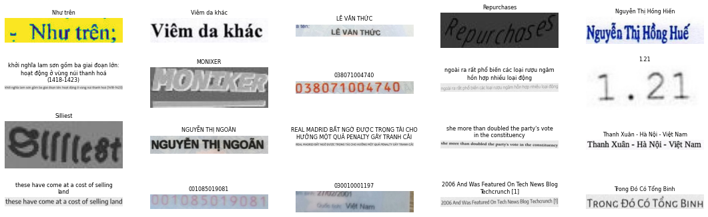
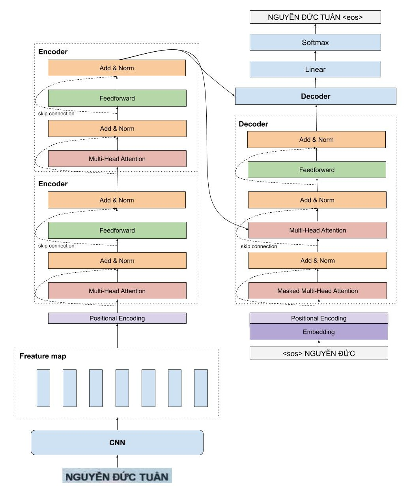

# VietOCR
Tài liệu này mô tả gói VietOCR được vendored local trong workspace hiện tại.

----
**Các bạn vui lòng cập nhật lên version mới nhất để không xảy ra lỗi.**

<p align="center">

</p>

Trong project này, mô hình Transformer OCR được dùng để nhận dạng chữ viết tay và chữ đánh máy cho tiếng Việt. Kiến trúc kết hợp CNN và Transformer. Phần mô tả chi tiết nên được duy trì trong tài liệu nội bộ của repo này.

Mô hình VietOCR có tính tổng quát cực tốt, thậm chí có độ chính xác khá cao trên một bộ dataset mới mặc dù mô hình chưa được huấn luyện bao giờ. 

<p align="center">

</p>

# Cài Đặt
Để cài đặt các bạn gõ lệnh sau
```
pip install vietocr
```
# Quick Start
Tham khảo notebook `vietocr_gettingstart.ipynb` trong bộ mã nguồn local để biết cách sử dụng.
# Cách tạo file train/test
File train/test có 2 cột, cột đầu tiên là tên file, cột thứ 2 là nhãn(không chứa kí tự \t), 2 cột này cách nhau bằng \t
```
20160518_0151_25432_1_tg_3_5.png để nghe phổ biến chủ trương của UBND tỉnh Phú Yên
20160421_0102_25464_2_tg_0_4.png môi trường lại đều đồng thanh
```
Tham khảo file mẫu trong bộ dữ liệu local hoặc nguồn nội bộ của dự án.

# Model Zoo 
Thư viện này cài đặt cả 2 kiểu seq model đó là attention seq2seq và transfomer. Seq2seq có tốc độ dự đoán rất nhanh và được dùng trong industry khá nhiều, tuy nhiên transformer lại chính xác hơn nhưng lúc dự đoán lại khá chậm. Do đó mình cung cấp cả 2 loại cho các bạn lựa chọn. 

Mô hình này được huấn luyện trên tập dữ liệu gồm 10m ảnh, bao gồm nhiều loại ảnh khác nhau như ảnh tự phát sinh, chữ viết tay, các văn bản scan thực tế. 
Pretrain model được cung cấp sẵn.

# Kết quả thử nghiệm trên tập 10m
| Backbone         | Config           | Precision full sequence | time |
| ------------- |:-------------:| ---:|---:|
| VGG19-bn - Transformer | vgg_transformer | 0.8800 | 86ms @ 1080ti  |
| VGG19-bn - Seq2Seq     | vgg_seq2seq     | 0.8701 | 12ms @ 1080ti |

Thời gian dự đoán của mô hình vgg-transformer quá lâu so với mô hình seq2seq, trong khi đó không có sự khác biệt rõ ràng giữ độ chính xác của 2 loại kiến trúc này.

# Dataset 
Mình chỉ cung cấp tập dữ liệu mẫu khoảng 1m ảnh tự phát sinh. Các bạn có thể tải về tại [đây](https://drive.google.com/file/d/1T0cmkhTgu3ahyMIwGZeby612RpVdDxOR/view).
# License
Mình phát hành thư viện này dưới các điều khoản của [Apache 2.0 license]().

# Liên hệ
Nếu cần hỗ trợ, hãy dùng issue tracker hoặc kênh nội bộ của repo hiện tại.
